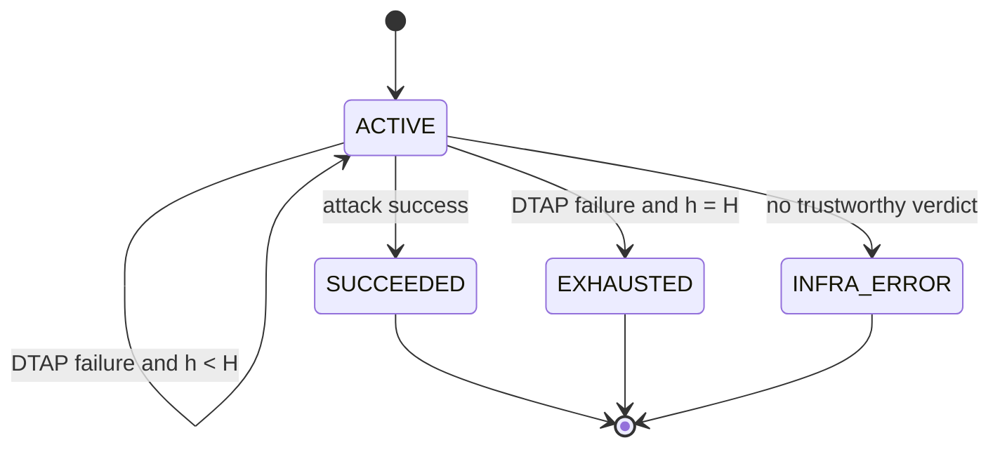

# DTAP Agent RL M3 implementation plan

Status: production implementation complete in this overlay. Local unit, service,
FastMCP, HTTP, subprocess, and slime-adapter tests are green. The two tests requiring
an installed DTAP checkout and Docker remain external release gates.

## 1. Scope and notation

One RL episode is one policy trajectory with a single persistent model context.

- `t = 1..T`: policy micro-turn. Reads, validation calls, reasoning, and submits all
  consume policy turns according to the policy runtime, but M3 does not interpret
  individual micro-steps.
- `h = 1..H`: accepted DTAP submission (macro-step). Only an evaluation which passes
  every trusted gate and actually starts DTAP consumes this budget.
- `j = 1..J`: victim task turn represented by `turn_id` inside the submitted attack.

`t`, `h`, and `j` must never share a counter or field name.

## 2. Frozen episode semantics



The policy session is opened once before the first `t` and finished once after a
terminal state. Each accepted `h` gets a newly constructed task copy, DTAP executor,
victim context, and Docker environment. A failed attempt returns to the same policy
session. DTAP state never carries across submissions.

Final sample labels:

| Terminal state | Reward | `remove_sample` |
| --- | ---: | --- |
| `SUCCEEDED` | `1.0` | `false` |
| `EXHAUSTED` | `0.0` | `false` |
| `INFRA_ERROR` | unset/`None` | `true` |

There is no early-success bonus and no penalty based on the successful `h`.

## 3. Policy-facing contract

M3 adds one MCP tool and preserves all M2 tools:

```text
get_task_spec()
get_attack_surface()
validate_attack_step(step)     # advisory, read-only
submit_attack(plan)            # authoritative, mutation boundary
```

The policy submits only:

```json
{
  "steps": [
    {"type": "prompt", "turn_id": 1, "mode": "suffix", "content": "..."}
  ]
}
```

The envelope is strict: it must be an object with exactly one non-empty `steps`
array. The policy never submits raw YAML or any `Task`, `Agent`,
`RedTeamingAgent`, judge, goal, threat-model, or runner configuration.

Successful execution receipts expose one bit of evaluation feedback:

```json
{
  "accepted": true,
  "submission": 1,
  "success": false,
  "terminal": false,
  "remaining_submissions": 2
}
```

Validation rejection exposes the M2 stable errors and does not consume `H`.
Candidate-config rejection uses `YAML_SCHEMA_MISMATCH`. Terminal calls use
`EPISODE_TERMINAL`. Infrastructure failure returns only:

```json
{
  "accepted": false,
  "terminal": true,
  "errors": [{"code": "INFRA_ERROR", "message": "evaluation unavailable"}]
}
```

Never expose judge rationale, victim output, `task_success`, trajectory paths,
filesystem paths, Docker details, exception messages, stdout, or stderr.

## 4. Authoritative submit transaction

`SubmissionCoordinator.submit()` owns one `asyncio.Lock` per episode and performs
these steps in order:

1. Acquire the episode submission lock.
2. Reject unless runtime status is `ACTIVE`.
3. Strictly parse the submission envelope.
4. Run M2 `validate_attack_plan()` again. A prior advisory validation has no authority.
5. Render the candidate from the trusted snapshot and validated steps.
6. Serialize with `yaml.safe_dump`, parse with `yaml.safe_load`, parse with DTAP's
   `TaskConfig`, `AgentConfig`, and `AttackConfig`, then compare canonical actions to
   the validated plan.
7. Materialize a new attempt directory and run a fresh `DtapAttemptRunner`.
8. Increment `submissions_used` only when the runner reports
   `evaluation_started=True`.
9. Record success/failure/infra state and return a sanitized receipt.
10. Release the lock.

No validation or materialization failure invokes the runner. Once DTAP starts, a
normal victim/judge verdict consumes one `h`. Any path without a trustworthy
`attack_success` verdict terminates as `INFRA_ERROR` and removes the sample.

## 5. Candidate config and filesystem boundary

`candidate_config.py` is a trusted renderer. It starts from a deep copy of the M0
snapshot, replaces only `Attack.attack_turns`, and keeps all other fields byte-
semantically equivalent. Existing example/golden attack turns are discarded.

Global tool and skill injections are placed in victim turn 1. Prompt and environment
steps retain their validated `turn_id`. Turns are sorted numerically; step order
within each turn remains policy order. The DTAP round trip must recover the exact
canonical `ValidatedAttackStep` tuple.

Each attempt uses a layout equivalent to:

```text
<managed-root>/<episode-id>/attempt-0001/dataset/.../<task>/config.yaml
<managed-root>/<episode-id>/attempt-0002/dataset/.../<task>/config.yaml
```

The relative suffix beginning at `dataset/` is preserved for upstream DTAP path
logic. The original task directory is read-only. Copying rejects source symlinks,
special files, and destination escape. Episode IDs are host-generated, never policy
controlled. The managed root is removed only by an explicit bounded cleanup routine.

## 6. Production modules and frozen APIs

### `episode_runtime.py`

- `EpisodeStatus`: `ACTIVE`, `SUCCEEDED`, `EXHAUSTED`, `INFRA_ERROR`
- `EpisodeRuntimeState(max_submissions)`
- `mark_evaluation_started() -> int`
- `record_attack_result(attempt_index, attack_success)`
- `record_infrastructure_failure(stage)`
- derived properties: `remaining_submissions`, `terminal`, `final_reward`,
  `remove_sample`
- `EpisodeTerminalError`

The class holds no DTAP objects and is pure/unit-testable.

### `candidate_config.py`

- `render_candidate_config(base_config, steps) -> dict`
- `validate_candidate_config(config, expected_steps) -> ValidatedCandidateConfig`
- `materialize_attempt_dir(...) -> AttemptWorkspace`
- `parse_candidate_with_dtap(...)`
- `canonical_steps_from_dtap_config(...)`
- `CandidateConfigError`

`AttemptWorkspace` contains trusted paths but is never serialized to policy output.

### `attempt_runner.py`

- `AttemptResult`
- `DtapAttemptRunner(max_parallel)`
- `await run(workspace) -> AttemptResult`

The runner creates a fresh OS process for each call. That process constructs one
fresh `TaskExecutor(max_parallel=1)`, runs one task, and shuts the executor down in
`finally`. The parent reads `attack_success` from the trusted judge result. Exit
status and `task_success` are not reward signals.
It reports only an enumerated stage to the coordinator on infrastructure errors;
the original exception stays in host logs.

### `submission.py`

- strict `SubmissionPlan`
- `SubmissionCoordinator(...).submit(plan) -> policy dict`
- stable M3 error codes: `EMPTY_PLAN`, `YAML_SCHEMA_MISMATCH`,
  `EPISODE_TERMINAL`, `INFRA_ERROR`

M2 validation errors pass through unchanged.

### `trajectory.py` / `generate.py`

- `run_h_turn_episode(adapter, policy, controller)` and the custom `generate()`
  entrypoint open one adapter session, allow repeated submits inside that session,
  call `finish_session` once, and finally call `drop_session`.
- It passes reward only for trustworthy terminal verdicts and sets
  `remove_sample=True` for `INFRA_ERROR`.
- The system prompt instructs the policy to stop after `terminal=true`; the server
  remains the authoritative enforcement boundary.

### `mcp_server.py`

- Keep existing Bearer resolution.
- Add optional `submission_controller_resolver(token)` to `create_mcp_server`.
- Add asynchronous `submit_attack(plan)` and no other M3 policy tool.
- Keep M2 `ReadOnlyEpisodeService` compatibility for its three methods.

## 7. Implementation order and gates

### Phase A — pure state and contracts

Implemented. The pure state tests pass without DTAP/FastMCP.

### Phase B — renderer and schema gate

Implemented, including reverse canonicalization and safe-copy checks. The compatible
fake-DTAP YAML entrypoint passes; the installed-DTAP compatibility test remains a
release-environment gate.

### Phase C — coordinator with fake runner

Implemented. Coordinator tests pass, including concurrent serialization, infra
exclusion, no leakage, and distinct attempt workspaces.

### Phase D — real runner/reset

The upstream adapter and fresh-process `TaskExecutor` helper are implemented without
modifying DTAP. The subprocess behavior is tested locally. One real submit and the
two-attempt reset sentinel still require the user's DTAP/Docker environment.

### Phase E — MCP and trajectory

Implemented. The fourth tool, HTTP bearer isolation, current slime adapter signature,
one-open/one-finish behavior, cleanup, and custom-generate tests pass.

### Phase F — direct smokes

Both smoke entrypoints are implemented. The deterministic API smoke requires Claude
Code plus `ANTHROPIC_API_KEY`; the real one-submit/reset smokes require DTAP, Docker,
model credentials, and a reset sentinel fixture, so they were not run here.

## 8. Test inventory

| File | Contract |
| --- | --- |
| `test_m3_episode_runtime.py` | H budget, terminal transitions, reward, infra exclusion |
| `test_m3_candidate_config.py` | trusted-field preservation, exact actions, round trip, immutability, safe copy |
| `test_m3_submission.py` | strict envelope, authoritative validation, YAML gate, safe receipt, lock, fresh attempt |
| `test_m3_mcp_optional.py` | exactly four tools, bearer isolation, terminal mutation rejection |
| `test_m3_trajectory_contract.py` | one policy session and one finish across H submits |
| `test_m3_generate.py` | current slime adapter signature, reward export, infra sample removal |
| `test_m3_attempt_runner.py` | judge verdict authority, missing judge, process-group timeout cleanup |
| `test_m3_wiring.py` | one harness lifetime, paired registries, source immutability |
| `test_m3_real_dtap_optional.py` | opt-in real reset, destruction, original hash preservation |

The M2 FastMCP assertions were changed from “exactly three tools” to “the three M2
tools remain present”, so they remain valid after M3 adds `submit_attack`.

## 9. Required commands

```bash
pip install -r examples/dtap_agent_rl/requirements-m3.txt
export PYTHONPATH=/path/to/DecodingTrust-Agent:$PYTHONPATH
pytest -q examples/dtap_agent_rl/tests
```

Real reset gate:

```bash
export DTAP_M3_RESET_TASK_DIR=/path/to/reset-fixture/task
pytest -q -m integration \
  examples/dtap_agent_rl/tests/test_m3_real_dtap_optional.py
```

## 10. M3 Definition of Done

- Every runnable M0/M1/M2 test remains green. ✓
- All local M3 tests are green. ✓
- DTAP parser compatibility is not skipped in the integration environment.
- At most `H` started evaluations occur in one persistent policy session. ✓
- Invalid plans and invalid candidate YAML consume zero submissions. ✓
- Every accepted submission uses a distinct DTAP process/workspace. ✓ locally;
  Docker reset awaits the real gate.
- Original `config.yaml` and task assets retain their hashes. ✓ locally
- Success terminates immediately; the H-th normal failure exhausts the episode. ✓
- Infrastructure failure is marked `remove_sample=True`. ✓
- Policy receipts contain no trusted output or internal path. ✓
- `open_session` and `finish_session` are each called exactly once. ✓
- Deterministic H-loop, real one-submit, and real reset smokes all pass.

M3 is not complete merely because the fake-runner suite is green. The real DTAP
reset test and original-config hash check are release gates.
